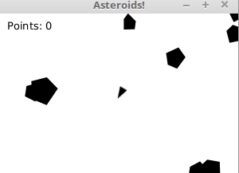

# Asteroids Game

A basic asteroids shooter game built with JavaFX 17 written in Java. 

The purpose of this program is to demonstrate the use of OOP principles (abstraction, encapsulation, polymorphism, and inheritence) when creating larger applications. 

# Build 
This game is intended for Java core principle demonstration purposes. If you wish to play the game, download the project
 directory and compile using your preferred IDE. 

<!-- # Details -->

# Commands
- Space - shoot

- Arrow keys - move the ship

# Acknowledgments
- [Formula for calculating corner angles of pentagons for asteroids](http://mathworld.wolfram.com/Pentagon.html)
